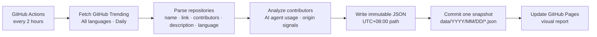
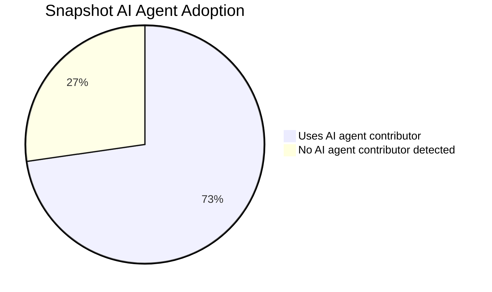

# GeekTrend

[中文默认版](README.md) · English

[](https://github.com/lurui1997/GeekTrend/actions/workflows/snapshot.yml)
[](https://github.com/lurui1997/GeekTrend/actions/workflows/pages.yml)


## Why GeekTrend

GitHub projects are seeing more visible bot and AI-agent contributions. On
[GitHub Trending](https://github.com/trending/), this signal is especially
interesting: trending repositories are where developers are actively building,
shipping, and attracting attention right now.

GeekTrend turns that public activity into an **agent contribute leaderboard**.
Instead of asking developers which coding agent they prefer, it watches which
agents actually appear in contributor lists across trending projects. That makes
the data a practical proxy for real developer agent selection: if `claude`,
`codex`, `cursor`, `github-copilot`, or another agent is repeatedly showing up
in current projects, it reflects tooling choices made in live development rather
than survey answers or marketing claims.

Each snapshot preserves the trending repositories shown at collection time and
adds a best-effort contributor analysis:

- whether any listed contributor is a known AI coding agent, such as `claude`,
  `codex`, `cursor`, `github-copilot`, or `copilot`;
- an inferred project origin country/region from public GitHub profile signals;
- the share of projects in the snapshot that use an AI agent contributor.

## How It Works

The [live report](https://lurui1997.github.io/GeekTrend/) shows the latest AI
agent adoption ratio, agent leaderboard, project-origin distribution, and
repository details. After each scheduled snapshot is published, the GitHub Pages
report is rebuilt automatically.





The pie chart above mirrors the first analyzed live smoke run: 8 of 11 current
Trending projects had a known AI agent contributor. Future snapshots store their
own `ai_agent_project_count` and `ai_agent_project_ratio`.

## Install and run

Python 3.13 is required. Create an isolated environment and install the fully pinned lock file:

```sh
python3.13 -m venv .venv
. .venv/bin/activate
python -m pip install -r requirements.lock
```

Collect into the current directory, or select another root for a smoke test:

```sh
python -m geektrend.cli
python -m geektrend.cli --output-root /tmp/geektrend-smoke
```

The command prints the relative path it created. Snapshots use UTC+08:00 time
and live at `data/YYYY/MM/DD/YYYY-MM-DDTHH-MM-SS+08-00.json`.

To inspect the newest local snapshot:

```sh
find data -type f -name '*.json' | sort | tail -1
```

Run the deterministic, offline test suite with:

```sh
python -m pytest -q
```

For step-by-step operation, snapshot inspection commands, and troubleshooting,
see [docs/USAGE.md](docs/USAGE.md).

## Snapshot Format

New snapshots have this shape:

```json
{
  "fetched_at": "2026-07-13T10:00:00+08:00",
  "source_url": "https://github.com/trending/",
  "repository_count": 1,
  "ai_agent_project_count": 1,
  "ai_agent_project_ratio": 1.0,
  "repositories": [
    {
      "repository_name": "owner/repository",
      "url": "https://github.com/owner/repository",
      "contributors": [
        {
          "username": "octocat",
          "url": "https://github.com/octocat"
        }
      ],
      "description": null,
      "primary_language": null,
      "ai_agent_contributors": ["claude"],
      "uses_ai_agent": true,
      "origin_country": "United States",
      "origin_confidence": "high",
      "origin_evidence": ["owner: location=New York City, NY"]
    }
  ]
}
```

`fetched_at` is UTC+08:00 at whole-second precision. `repository_count` equals
the length of `repositories`; repository and contributor URLs are canonical
GitHub URLs. `contributors` is always an array, possibly empty. `description`
and `primary_language` are nullable.

Contributor analysis is best-effort and uses public GitHub profile fields.
`ai_agent_contributors` records known AI coding agent usernames such as
`claude`, `codex`, `cursor`, `github-copilot`, and `copilot`; Dependabot is not
counted as an AI coding agent. `origin_country` is an inferred project origin,
not a claim about nationality. `origin_confidence` is `high` when the owner
profile provides the signal, `medium` when multiple human contributors agree,
`low` for a single non-owner signal, and `unknown` when no usable public signal
is available. `ai_agent_project_ratio` is the share of repositories in the
snapshot where `uses_ai_agent` is true.

Older snapshots created before contributor analysis was added may not contain
the AI agent and origin fields. Treat each file as immutable historical data.

### Analysis Fields

| Field | Level | Meaning |
|---|---|---|
| `ai_agent_contributors` | repository | Known AI coding agent contributor usernames found in the Trending card |
| `uses_ai_agent` | repository | `true` when `ai_agent_contributors` is not empty |
| `origin_country` | repository | Best-effort origin inferred from public GitHub profile signals |
| `origin_confidence` | repository | `high`, `medium`, `low`, or `unknown` depending on evidence strength |
| `origin_evidence` | repository | Short public-profile evidence used for the origin inference |
| `ai_agent_project_count` | snapshot | Number of repositories where `uses_ai_agent` is `true` |
| `ai_agent_project_ratio` | snapshot | `ai_agent_project_count / repository_count`, rounded to 4 decimals |

## Automation

The `Capture GitHub Trending` Actions workflow is scheduled every two hours and
can also be run manually from GitHub Actions. GitHub schedules are best effort,
so a delayed or skipped run is not backfilled.

The workflow:

1. checks out the repository;
2. installs the pinned Python dependencies;
3. runs the offline test suite;
4. collects the current GitHub Trending page;
5. enriches contributors with GitHub profile analysis using `GITHUB_TOKEN`;
6. commits exactly one new snapshot file back to the branch.
7. triggers the `Publish Pages Report` workflow to rebuild and publish the
   [GitHub Pages live report](https://lurui1997.github.io/GeekTrend/).

In the repository, select **Settings → Actions → General → Workflow permissions
→ Read and write permissions** (`contents: write`) so a successful snapshot can
be committed and pushed.

## Operating Constraints

One concurrency group serializes runs without cancelling an in-progress collection. Publication retries a bounded number of push races, never overwrites or backfills an existing path, and treats every successfully published snapshot as immutable.

GitHub provides no official Trending API. This project parses the public
Trending HTML, so GitHub markup changes can break collection; failures leave no
snapshot. Contributor enrichment uses public GitHub profile data and degrades to
`unknown` when profile signals or API requests are unavailable. Tests use local
fixtures and never require the network.

The writer publishes atomically with a hard link to guarantee no-overwrite behavior. The output root and its temporary file must therefore be on a filesystem that supports hard links.
