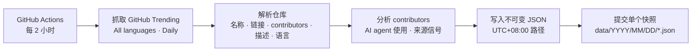
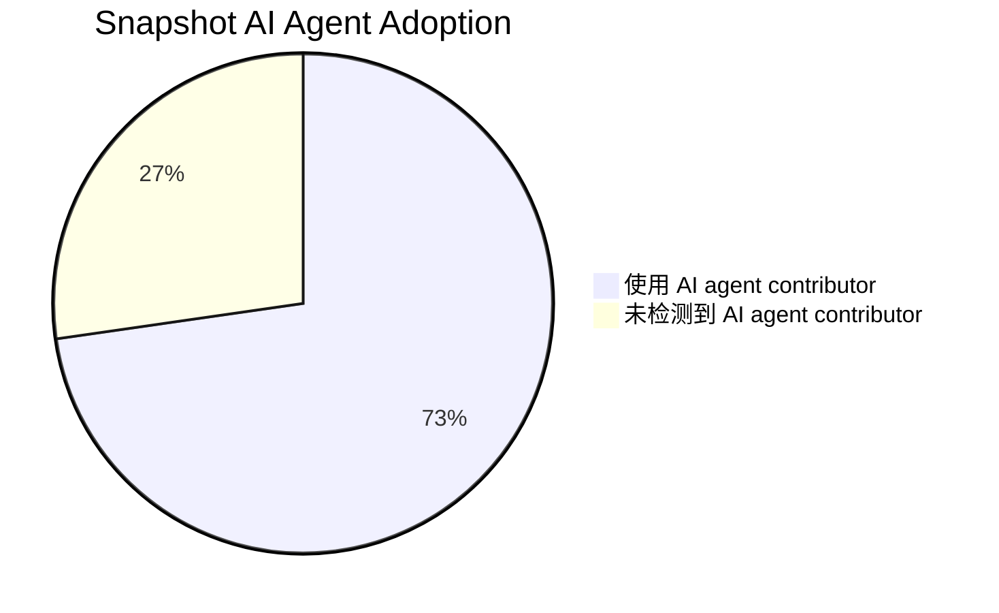

# GeekTrend

默认中文 · [English](README.en.md)

[](https://github.com/lurui1997/GeekTrend/actions/workflows/snapshot.yml)


## 为什么做 GeekTrend

GitHub 项目里越来越常见 bot 和 AI agent 的贡献痕迹。在
[GitHub Trending](https://github.com/trending/) 上，这个信号尤其有价值：Trending
项目代表开发者正在真实构建、发布、协作和获得关注的方向。

GeekTrend 把这些公开活动沉淀成一份 **agent contribute 榜**。它不是问开发者“你喜欢哪个
coding agent”，而是观察哪些 agent 真实出现在热门项目的 contributor 列表里。也就是说，
如果 `claude`、`codex`、`cursor`、`github-copilot` 或其他 agent 反复出现在当前项目中，
这比问卷或营销口径更接近开发者真实的 agent 选型。

每份快照都会保存当时的 Trending 仓库，并补充一组尽力而为的 contributor 分析：

- 是否出现已知 AI coding agent contributor，例如 `claude`、`codex`、`cursor`、
  `github-copilot` 或 `copilot`；
- 根据公开 GitHub profile 信号推断项目来源国家/地区；
- 统计当前快照中使用 AI agent contributor 的项目占比。

## 工作流程





上面的饼图来自第一次带分析能力的 live smoke run：当时 11 个 Trending 项目里，有 8 个项目
检测到已知 AI agent contributor。之后每份快照都会保存自己的
`ai_agent_project_count` 和 `ai_agent_project_ratio`。

## 安装与运行

项目需要 Python 3.13。创建隔离环境并安装锁定依赖：

```sh
python3.13 -m venv .venv
. .venv/bin/activate
python -m pip install -r requirements.lock
```

采集到当前仓库，或指定临时目录做 smoke test：

```sh
python -m geektrend.cli
python -m geektrend.cli --output-root /tmp/geektrend-smoke
```

命令会输出创建的相对路径。快照使用 UTC+08:00 时间，路径格式为：

```text
data/YYYY/MM/DD/YYYY-MM-DDTHH-MM-SS+08-00.json
```

查看本地最新快照：

```sh
find data -type f -name '*.json' | sort | tail -1
```

运行离线测试：

```sh
python -m pytest -q
```

更完整的操作步骤、快照查看命令和排障说明见 [docs/USAGE.md](docs/USAGE.md)。

## 快照格式

新快照结构如下：

```json
{
  "fetched_at": "2026-07-13T10:00:00+08:00",
  "source_url": "https://github.com/trending/",
  "repository_count": 1,
  "ai_agent_project_count": 1,
  "ai_agent_project_ratio": 1.0,
  "repositories": [
    {
      "repository_name": "owner/repository",
      "url": "https://github.com/owner/repository",
      "contributors": [
        {
          "username": "octocat",
          "url": "https://github.com/octocat"
        }
      ],
      "description": null,
      "primary_language": null,
      "ai_agent_contributors": ["claude"],
      "uses_ai_agent": true,
      "origin_country": "United States",
      "origin_confidence": "high",
      "origin_evidence": ["owner: location=New York City, NY"]
    }
  ]
}
```

`fetched_at` 使用 UTC+08:00，并精确到秒。`repository_count` 等于 `repositories` 的长度；
仓库和 contributor URL 都是规范 GitHub URL。`contributors` 永远是数组，可以为空。
`description` 和 `primary_language` 可以为 `null`。

Contributor 分析使用公开 GitHub profile 字段，属于尽力而为。`ai_agent_contributors`
记录已知 AI coding agent 用户名，例如 `claude`、`codex`、`cursor`、`github-copilot`
和 `copilot`；Dependabot 不计为 AI coding agent。`origin_country` 是项目来源推断，
不是 contributor 国籍声明。`origin_confidence` 的含义：

- `high`：仓库 owner profile 提供来源信号；
- `medium`：多个 human contributors 指向同一来源；
- `low`：只有一个非 owner human contributor 提供可用信号；
- `unknown`：没有可靠公开信号。

旧快照是在 contributor 分析功能上线前生成的，可能没有 AI agent 和来源字段。请把每份快照都视为不可变历史数据。

### 分析字段

| 字段 | 层级 | 含义 |
|---|---|---|
| `ai_agent_contributors` | repository | Trending card 中检测到的已知 AI coding agent 用户名 |
| `uses_ai_agent` | repository | 当 `ai_agent_contributors` 非空时为 `true` |
| `origin_country` | repository | 根据公开 GitHub profile 信号推断的项目来源 |
| `origin_confidence` | repository | `high`、`medium`、`low` 或 `unknown` |
| `origin_evidence` | repository | 用于来源推断的简短公开 profile 证据 |
| `ai_agent_project_count` | snapshot | `uses_ai_agent` 为 `true` 的仓库数量 |
| `ai_agent_project_ratio` | snapshot | `ai_agent_project_count / repository_count`，保留 4 位小数 |

## 自动化

`Capture GitHub Trending` GitHub Actions workflow 每 2 小时运行一次，也可以在 GitHub Actions
页面手动触发。GitHub schedule 是 best effort，所以延迟或跳过的运行不会回填。

workflow 会：

1. checkout 仓库；
2. 安装锁定的 Python 依赖；
3. 运行离线测试；
4. 采集当前 GitHub Trending 页面；
5. 使用 `GITHUB_TOKEN` 补充 contributor profile 分析；
6. 把一个新快照文件提交回分支。

为了让 workflow 能提交快照，需要在 GitHub 仓库里开启：

```text
Settings → Actions → General → Workflow permissions → Read and write permissions
```

## 运行约束

workflow 使用一个 concurrency group 串行化运行，不会取消正在执行的采集。发布步骤会有限重试 push
竞争，但永远不会覆盖或回填已有快照路径；每个成功发布的快照都视为不可变数据。

GitHub 没有官方 Trending API。本项目解析公开 Trending HTML，所以 GitHub markup 变化可能导致采集失败；
失败时不会生成快照。Contributor enrichment 使用公开 GitHub profile 数据；当 profile 信号缺失或 API
请求失败时，会降级为 `unknown`。测试使用本地 fixtures，不依赖网络。

写入器使用 hard link 原子发布快照以保证 no-overwrite 行为。因此 output root 和临时文件必须位于支持
hard link 的文件系统上。
